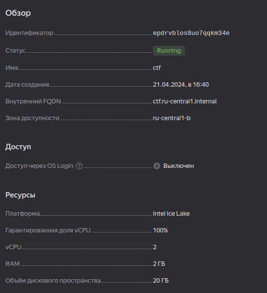

# Домашнее задание: Работа с уровнями изоляции транзакции в PostgreSQL

### 1. Создание проекта

Буду делать в YC

### 2. Создание виртуальной машины



### 3. Добавление SSH ключа

cat ~/.ssh/id_rsa.pub 
вывод файла в интерфейс YC в поле соответствующее

### 4. Подключение по SSH

```bash
ssh r314tive@84.201.139.214
```

### 5. Установка PostgreSQL

```bash
{24-06-11 18:59}ctf:~ r314tive% apt list --installed |  grep postgres

WARNING: apt does not have a stable CLI interface. Use with caution in scripts.

postgresql-12/now 12.18-1.pgdg22.04+1 amd64 [installed,upgradable to: 12.19-1.pgdg22.04+1]
postgresql-16/jammy-pgdg,now 16.3-1.pgdg22.04+1 amd64 [installed]
postgresql-client-12/now 12.18-1.pgdg22.04+1 amd64 [installed,upgradable to: 12.19-1.pgdg22.04+1]
postgresql-client-16/jammy-pgdg,now 16.3-1.pgdg22.04+1 amd64 [installed,automatic]
postgresql-client-common/jammy-pgdg,now 260.pgdg22.04+1 all [installed,automatic]
postgresql-common/jammy-pgdg,now 260.pgdg22.04+1 all [installed,automatic]
postgresql-contrib/jammy-pgdg,now 16+260.pgdg22.04+1 all [installed]
{24-06-11 18:59}ctf:~ r314tive% sudo systemctl list-units | grep postgres
  postgresql.service                                                             loaded active     exited    PostgreSQL RDBMS
  postgresql@16-main.service                                                     loaded active     running   PostgreSQL Cluster 16-main
  system-postgresql.slice                                                        loaded active     active    Slice /system/postgresql
```

### 6. Отключение авто-commit

```bash
sudo -i -u postgres
psql
```

Отключите авто-commit:
```sql
\set AUTOCOMMIT off
```

### 7. Создание таблицы и наполнение данными

```bash
{24-06-11 19:05}ctf:~ r314tive% sudo -iu postgres
postgres@ctf:~$ psql
```
```sql
postgres=# CREATE TABLE persons(id serial, first_name text, second_name text);
INSERT INTO persons(first_name, second_name) VALUES('ivan', 'ivanov');
INSERT INTO persons(first_name, second_name) VALUES('petr', 'petrov');
COMMIT;
CREATE TABLE
INSERT 0 1
INSERT 0 1
COMMIT
```

### 8. Проверка уровня изоляции

```sql
postgres=# SHOW transaction isolation level;
 transaction_isolation 
-----------------------
 read committed
(1 row)
```

### 9. Тестирование уровня изоляции Read Committed

1. Начните новую транзакцию в обоих сессиях с дефолтным уровнем изоляции.

   **Первая сессия:**
   ```sql
   BEGIN;
   INSERT INTO persons(first_name, second_name) VALUES('sergey', 'sergeev');
   ```

   **Вторая сессия:**
   ```sql
   BEGIN;
   SELECT * FROM persons;
   ```

   **Вопрос:** Видите ли вы новую запись?
   **Ответ:** Нет, потому что транзакция в первой сессии еще не завершена (commit не выполнен).

2. Завершите первую транзакцию:
   ```sql
   COMMIT;
   ```

   **Вторая сессия:**
   ```sql
   SELECT * FROM persons;
   ```

   **Вопрос:** Видите ли вы новую запись?
   **Ответ:** Да, потому что транзакция в первой сессии завершена, и изменения стали видны.

3. Завершите транзакцию во второй сессии:
   ```sql
   COMMIT;
   ```

### 10. Тестирование уровня изоляции Repeatable Read

1. Начните новые транзакции с уровнем изоляции repeatable read.

   **Первая сессия:**
   ```sql
   SET TRANSACTION ISOLATION LEVEL REPEATABLE READ;
   BEGIN;
   INSERT INTO persons(first_name, second_name) VALUES('sveta', 'svetova');
   ```

   **Вторая сессия:**
   ```sql
   SET TRANSACTION ISOLATION LEVEL REPEATABLE READ;
   BEGIN;
   SELECT * FROM persons;
   ```

   **Вопрос:** Видите ли вы новую запись?
   **Ответ:** Нет, потому что транзакция в первой сессии еще не завершена и уровень изоляции repeatable read.

2. Завершите первую транзакцию:
   ```sql
   COMMIT;
   ```

   **Вторая сессия:**
   ```sql
   SELECT * FROM persons;
   ```

   **Вопрос:** Видите ли вы новую запись?
   **Ответ:** Нет, потому что транзакция во второй сессии была начата до коммита в первой сессии и уровень изоляции repeatable read.

3. Завершите вторую транзакцию:
   ```sql
   COMMIT;
   ```

4. Сделайте select снова во второй сессии:
   ```sql
   SELECT * FROM persons;
   ```

   **Вопрос:** Видите ли вы новую запись?
   **Ответ:** Да, потому что транзакция завершена и изменения стали видны.

## Миниотчет

# Отчет по работе с уровнями изоляции транзакции в PostgreSQL

## Цель
Научиться работать с уровнями изоляции транзакций в PostgreSQL и понимать особенности работы уровней read committed и repeatable read.

## Шаги выполнения

### Создание проекта и виртуальной машины
Создан (ещё давно назвал так) проект `ctf` в Яндекс Облаке, vm с ubuntu:
Ресурсы
Платформа
Intel Ice Lake
Гарантированная доля vCPU
100%
​vCPU
2
RAM
2 ГБ
Объём дискового пространства
20 ГБ

### Установка PostgreSQL и подключение по SSH
PostgreSQL установлен, подключение по SSH выполнено.

### Создание таблицы и наполнение данными
Создана таблица `persons` и добавлены данные

### Проверка уровня изоляции
Текущий (дефолтный) уровень изоляции: `read committed`.

### Тестирование уровня изоляции Read Committed
1. Вставка новой записи в первой сессии и проверка во второй:
   - До коммита: запись не видна.
   - После коммита: запись видна.

2. Завершение транзакций.

### Тестирование уровня изоляции Repeatable Read
1. Вставка новой записи в первой сессии и проверка во второй:
   - До коммита: запись не видна.
   - После коммита: запись не видна.

2. Завершение транзакций и повторная проверка:
   - Запись видна после завершения всех транзакций.

## Выводы
Уровни изоляции read committed и repeatable read обеспечивают разные уровни видимости данных в транзакциях.
При уровне изоляции read committed данные становятся видны другим транзакциям сразу после коммита.
При уровне изоляции repeatable read данные, зафиксированные другими транзакциями после начала текущей транзакции, остаются невидимыми до завершения текущей транзакции.